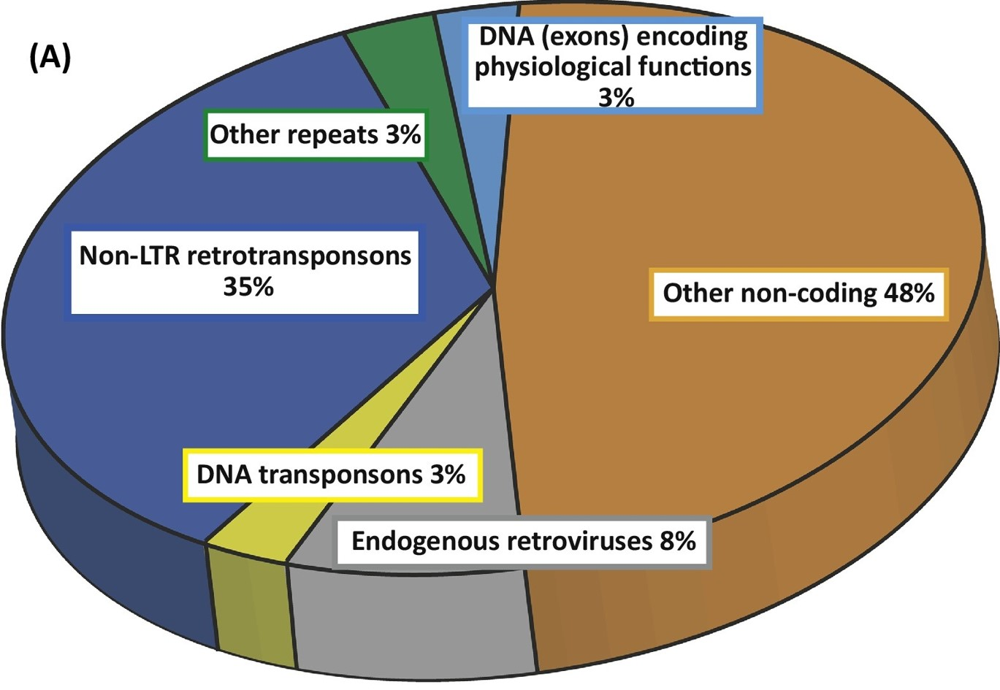

About 8% of human genome are come from retroviruses. hERVs are relics of ancient multiple infections that affected human germ line along the last 100 million of years, and became stable elements at the genome. Most hERVs are not active and functional due to the interruptions caused by multiple insertions/mutations. To investigate the expression of hERVs from RNA-seq data may find a missing piece to the human transcriptome jigsaw puzzle.   


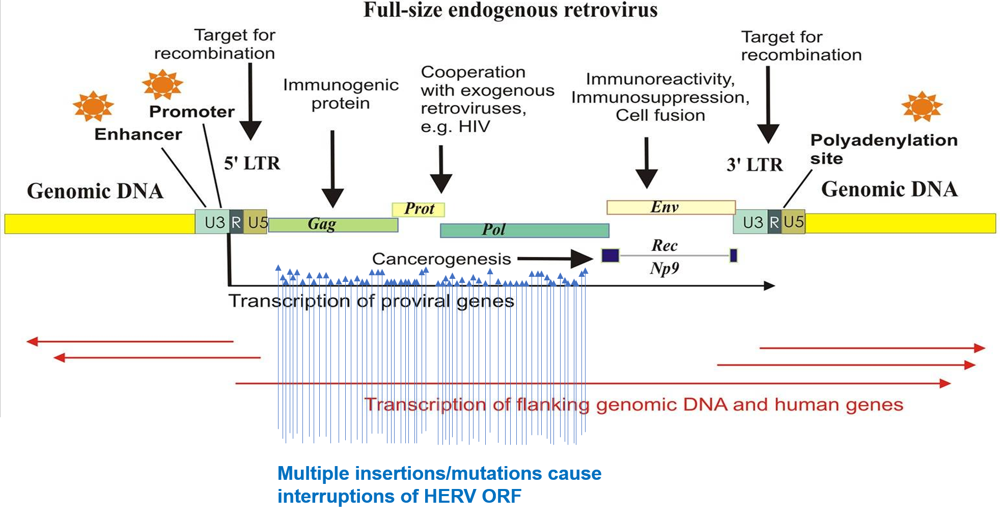


Download the annotation file from: https://github.com/mlbendall/telescope_annotation_db/tree/master/builds

The one combines HERV_rmsk.hg38.v2 and L1Base.hg38.v1, with 28,513 loci in total. Save as hERV.gtf

Combine this hERV gtf file with GRCh38.100.gtf

```{bash}
cat GRCh38.100_hERV.gtf hERV.gtf > GRCh38.100_hERV.gtf
```


Build bowtie2 index use rsem-prepare-reference

```{bash}
rsem-prepare-reference \
--gtf GRCh38.100_hERV.gtf \
--bowtie2 \
-p 32 \
Homo_sapiens.GRCh38.dna.primary_assembly.fa \
hg38ERV_index/hg38_hERV
```


Download raw fastq files from these three datasets.
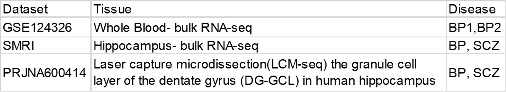


Use rsem-calculate-expression to get the expression matrix from the raw fastq files.

```{bash}
rsem-calculate-expression \
--bowtie2 \
--paired-end Sample1_F.fastq.gz Sample1_R.fastq.gz
-p 32 \
hg38ERV_index/hg38_hERV \
rsem/Sample1
```

Use DESeq2 R package to identify differential expressed genes(hERVs):

There is only one differential expressed hERV from the Whole blood RNA-seq

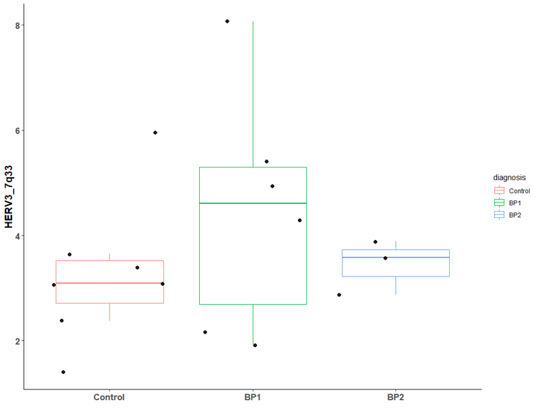

There are 6 differential expressed hERV from the Hippocampus bulk RNA-seq

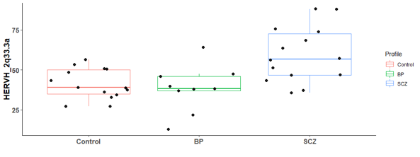
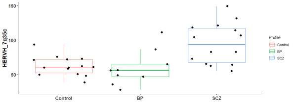
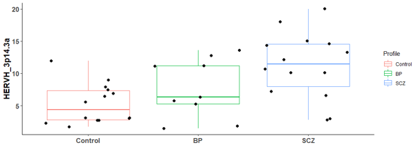
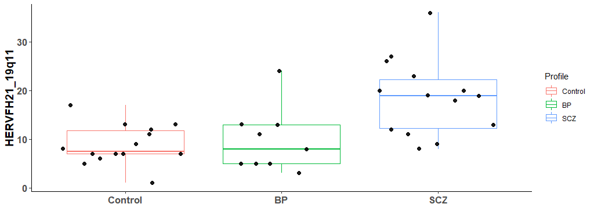
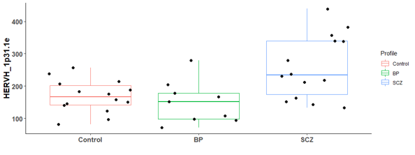
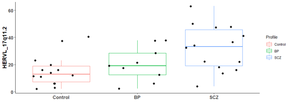


There are many differential expressed hERVs and genes in the Laser capture microdissection (LCM) of the granule cell layer of the dentate gyrus (DG-GCL) in human hippocampus. Maybe because the high purity of the cell source.

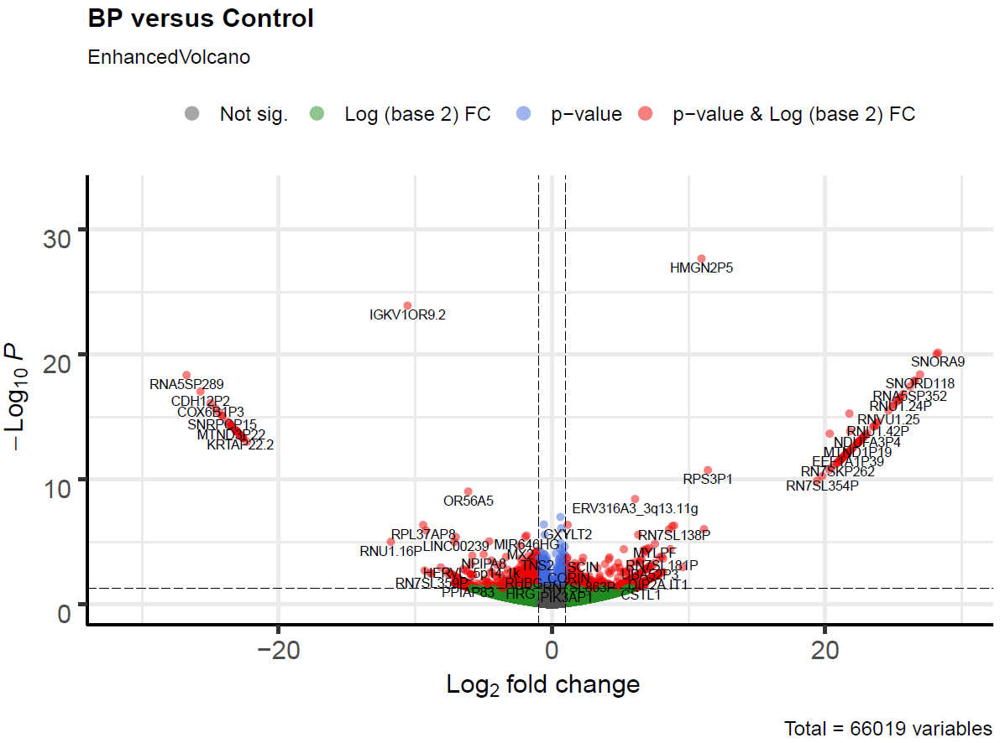


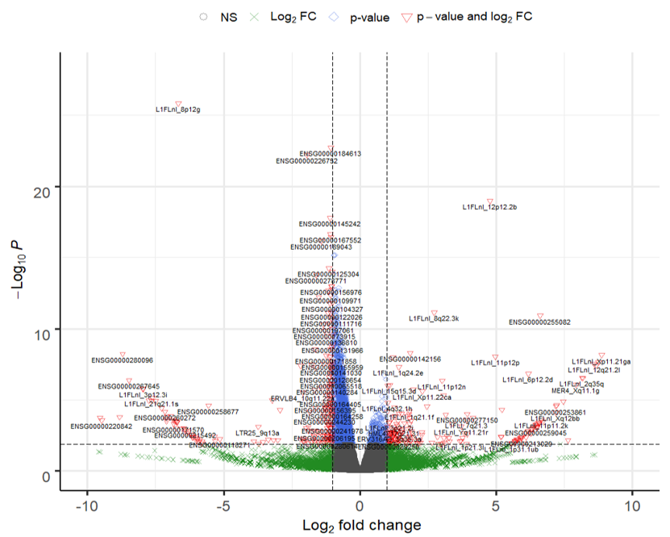

To be continued.....
